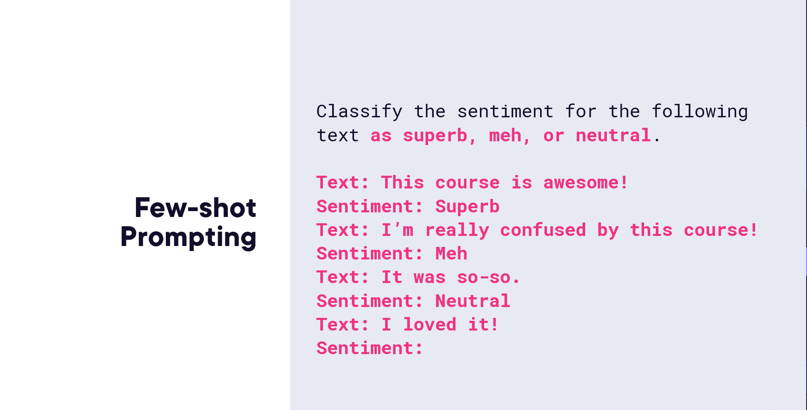
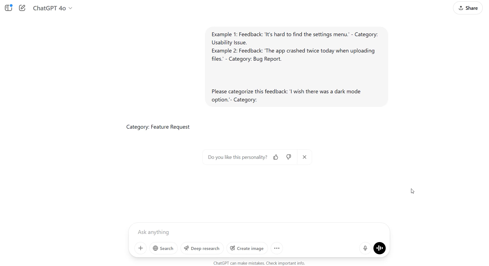
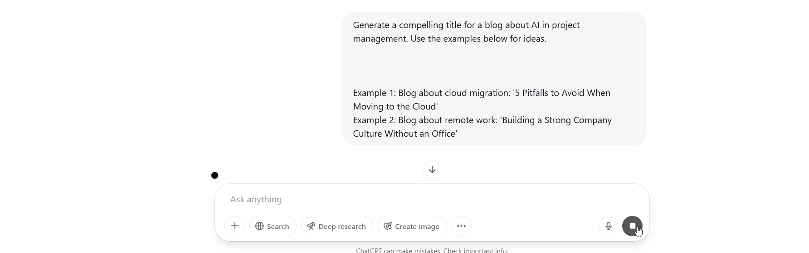
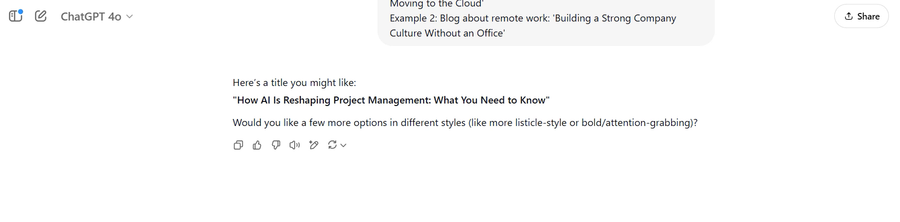
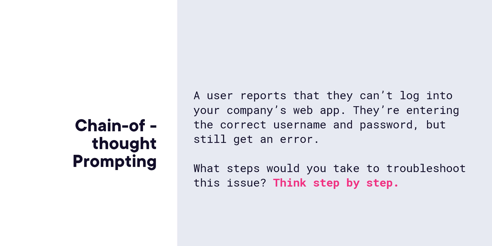
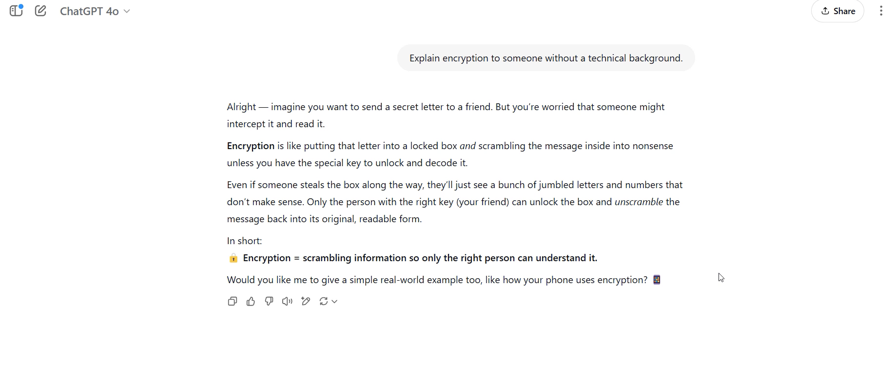
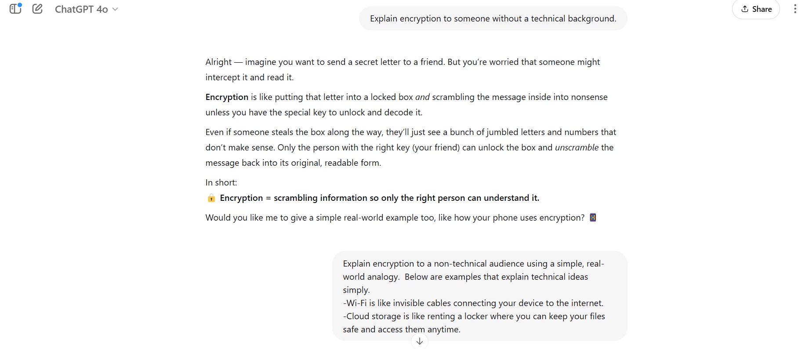
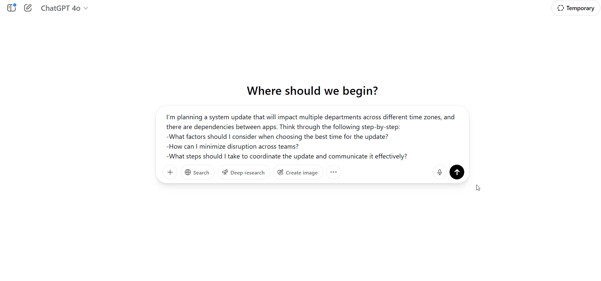

# The Anatomy of a Prompt

---

## Module 1 — Les composants d'un prompt efficace

### Sujet du cours

Comprendre la structure d'un bon prompt et identifier ses composants essentiels pour formuler des instructions plus efficaces.

### Concepts clés

- **Persona** : rôle ou perspective que le modèle doit adopter (ex. : développeur, scientifique, rédacteur technique).
- **Instructions** : cœur du prompt — ce que le modèle doit faire. Doit commencer par un verbe d'action, être clair et concis.
- **Contexte d'entrée** : texte à traiter, question à répondre, ou exemple de sortie attendue.
- **Format** : structure souhaitée pour la réponse (liste, rapport, post réseaux sociaux, etc.).
- **Informations supplémentaires** : contraintes, connaissances contextuelles, public cible.

### Explications essentielles

Un prompt n'a pas besoin de contenir tous ces composants, mais doit toujours inclure au minimum les **instructions**. Plus les autres composants sont renseignés, plus la réponse sera pertinente et adaptée.

### Exemples importants

**Prompt complet (analyste de données) :**
> *As a data analyst preparing a report for executives, generate a summary of key findings from the Q2 sales performance dataset, written in natural language, with 3–4 insights and one chart recommendation. Avoid technical terms; focus on business impact and trends.*

**Prompt complet (rédacteur technique) :**
> *As a technical writer creating internal documentation, summarize the following API documentation for the login and logout endpoints into a concise quick reference guide with clear descriptions and example calls.*

### Points à retenir

- Un prompt efficace combine : **persona + instructions + contexte + format + informations supplémentaires**.
- Les instructions sont le seul élément obligatoire ; les autres enrichissent et précisent la réponse.

---

## Module 2 — Zero-Shot Prompting

### Sujet du cours

Le zero-shot prompting consiste à soumettre une tâche au modèle sans lui fournir d'exemples, en s'appuyant uniquement sur ses connaissances générales acquises lors de l'entraînement.

### Concepts clés

- **Zero-shot** : aucun exemple fourni dans le prompt.
- Le modèle s'appuie exclusivement sur son **entraînement général** pour répondre.

### Explications essentielles

C'est la forme de prompting la plus simple et la plus courante. Elle fonctionne bien pour des tâches portant sur des connaissances générales que le modèle possède déjà (résumés, brainstorming, explications de concepts, comparaisons).

### Exemples importants

| Tâche                   | Prompt zero-shot                                                              |
|-------------------------|-------------------------------------------------------------------------------|
| Analyse de sentiment    | *Classify the sentiment of the following text: [texte]*                       |
| Résumé de service cloud | *Summarize the features of Amazon S3.*                                        |
| Brainstorming           | *Suggest 5 small AI projects I could work on over the weekend.*               |
| Explication de concept  | *Explain the differences between [concepts] in plain English without jargon.* |

### Points à retenir

- Idéal pour les tâches basées sur des **connaissances générales** déjà présentes dans le modèle.
- Pas besoin d'exemples — la tâche suffit.

---

## Module 3 — Few-Shot Prompting

### Sujet du cours

Le few-shot prompting enrichit le prompt avec quelques exemples pour guider le modèle vers un format, un ton ou des catégories spécifiques qu'il ne pourrait pas deviner seul.

### Concepts clés

- **Few-shot** : le prompt inclut un ou plusieurs exemples illustrant la réponse attendue.
- Les exemples peuvent être placés **au début ou à la fin** du prompt.
- Permet de définir des **catégories personnalisées** ou un **style particulier**.

### Explications essentielles

Lorsque la tâche requiert un format non standard, un ton spécifique ou des catégories que le modèle ne connaît pas par défaut, les exemples servent de mini-entraînement contextuel pour orienter la réponse.

### Exemples importants

**Analyse de sentiment personnalisée :**

```
Text: "Absolutely loved it!" → Sentiment: Superb
Text: "It was okay, nothing special." → Sentiment: Meh
Text: "No strong feelings either way." → Sentiment: Neutral
Text: "I wish there was a dark mode option." → Sentiment:
```

**Catégorisation de feedback utilisateur :**

```
Feedback: "The buttons are too small on mobile." → Category: Usability Issue
Feedback: "The app crashes when I upload a photo." → Category: Bug Report
Feedback: "I wish there was a dark mode option." → Category:
```
→ Résultat : *Feature Request*

**Génération de titres de blog dans un style donné :**
Fournir 2 exemples de titres existants, puis demander un titre pour un nouveau sujet.


Result:



### Points à retenir

- Utiliser le few-shot prompting pour imposer un **ton, un style, un format ou des catégories non standards**.
- Les exemples peuvent être placés n'importe où dans le prompt — l'essentiel est qu'ils soient présents.

---

## Module 4 — Chain-of-Thought Prompting

### Sujet du cours

Le chain of thought (COT) prompting pousse le modèle à décomposer un problème complexe en étapes successives, produisant des réponses plus détaillées, raisonnées et fiables.

### Concepts clés

- **Chain-of-thought (COT)** : technique qui encourage le modèle à raisonner étape par étape.
- Mots-clés déclencheurs : *"think step-by-step"*, *"think out loud"*, *"reason through"*.


### Explications essentielles

Pour des problèmes complexes (déploiement technique, débogage, coordination organisationnelle), demander au modèle de détailler son raisonnement permet d'obtenir des réponses plus complètes et mieux argumentées que si l'on demandait directement une conclusion.

### Exemples importants

| Problème                             | Prompt COT                                                                                                                    |
|--------------------------------------|-------------------------------------------------------------------------------------------------------------------------------|
| Choix d'architecture cloud           | *We need to deploy a web app that must scale quickly. Step-by-step, reason through these options: [options].*                 |
| Débogage d'erreur                    | *Think step-by-step through what could cause this error and how to fix it: [erreur].*                                         |
| Amélioration d'onboarding UX         | *Think through step-by-step what elements would make a good onboarding experience and how to measure success.*                |
| Planification de mise à jour système | *Think through the following step by step: [contraintes]. Help me identify the best time and steps to coordinate the update.* |

### Points à retenir

- Utiliser COT pour les **problèmes complexes, multi-étapes ou nécessitant une justification**.
- Toujours inclure des formules comme *"step-by-step"* ou *"think out loud"* pour activer le raisonnement détaillé.

---

## Module 5 — Stratégies générales pour de meilleurs prompts

### Sujet du cours

Principes universels applicables à tout prompt pour en améliorer systématiquement la qualité.

### Méthodes / Raisonnements

1. **Être clair sur l'objectif** : utiliser des verbes d'action, préciser le public cible et le type de sortie attendu.
2. **Fournir du contexte** : inclure les faits pertinents, documents ou informations de fond pour aider le modèle à faire de meilleures prédictions.
3. **Être aussi spécifique que possible** : décomposer la demande, quantifier les attentes.
4. **Itérer et affiner** : un bon prompt est rarement parfait du premier coup — tester, reformuler, ajuster.
5. **Encourager l'auto-critique** : demander au modèle de vérifier ses lacunes ou hypothèses implicites, ce qui aide à détecter d'éventuels biais dans les réponses.

### Points à retenir

- Le prompting efficace est un **processus itératif**, pas une opération unique.
- Demander au modèle de **s'auto-évaluer** est une technique puissante pour améliorer la qualité et réduire les biais.


## Module 6 — Mise en pratique : Applying What You've Learned

### Sujet du cours

Exercices concrets pour appliquer les trois types de prompting (zero-shot, few-shot, chain-of-thought) sur des cas réels.

### Exercice 1 — Zero-shot vs Few-shot

**Objectif :** expliquer un concept technique à un public non technique avec les deux approches.

| Type          | Prompt exemple                                                                                                                                       |
|---------------|------------------------------------------------------------------------------------------------------------------------------------------------------|
| **Zero-shot** | *Explain encryption to someone without a technical background.*                                                                                      |
| **Few-shot**  | *Explain encryption using a real-world analogy. Example 1: [analogie pour concept A]. Example 2: [analogie pour concept B]. Now explain encryption.* |

### Zero-shot


### Few-shot


Résultat du few-shot obtenu : *"Encryption is like sending a locked treasure chest through the mail"* — le modèle a reproduit le format des analogies fournies en exemple.

### Exercice 2 — Chain-of-Thought

**Scénario :** planifier une mise à jour système impliquant plusieurs départements, des fuseaux horaires différents et des dépendances entre applications.

**Prompt COT :**
> *We need to perform a system update across multiple departments. Some teams work in different time zones and there are dependencies between apps. Think through the following step by step: [liste des contraintes]. Help me identify the best time for the update and the steps to coordinate it.*



**Résultat attendu :** le modèle détaille les étapes — choix du meilleur créneau horaire, facteurs à considérer, stratégie pour minimiser les interruptions, ordre de mise à jour selon les dépendances.

### Points à retenir

- **Zero-shot** : suffisant pour les connaissances générales, sans exemples.
- **Few-shot** : indispensable quand on veut imposer un format ou un style précis via des exemples.
- **Chain-of-thought** : à privilégier pour tout problème complexe nécessitant une décomposition en étapes.