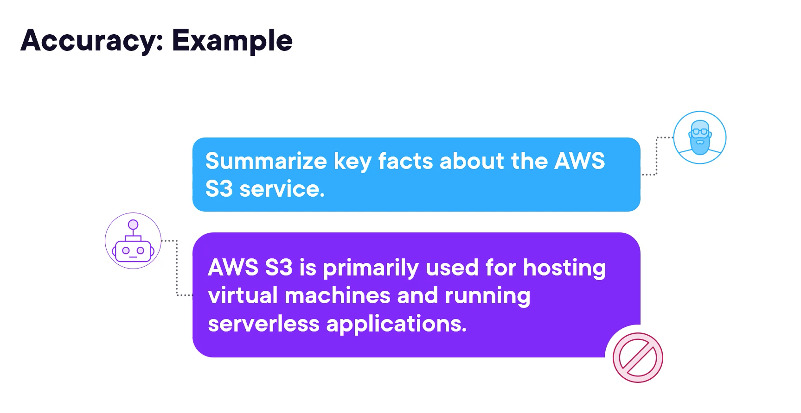
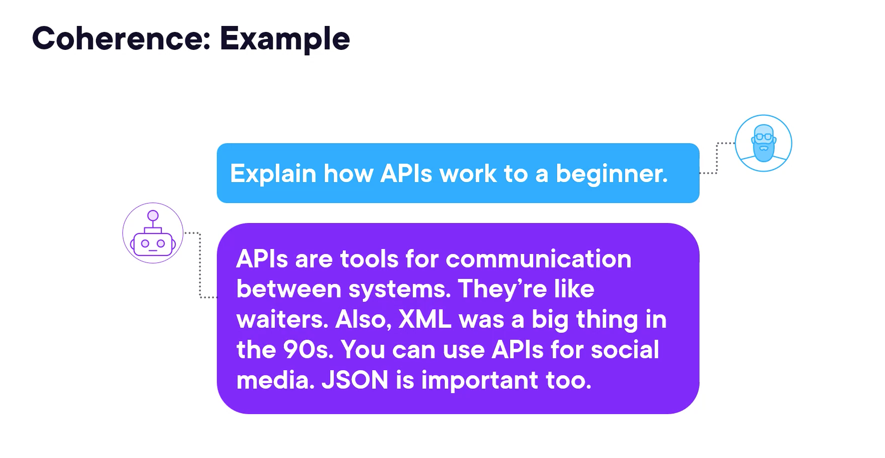
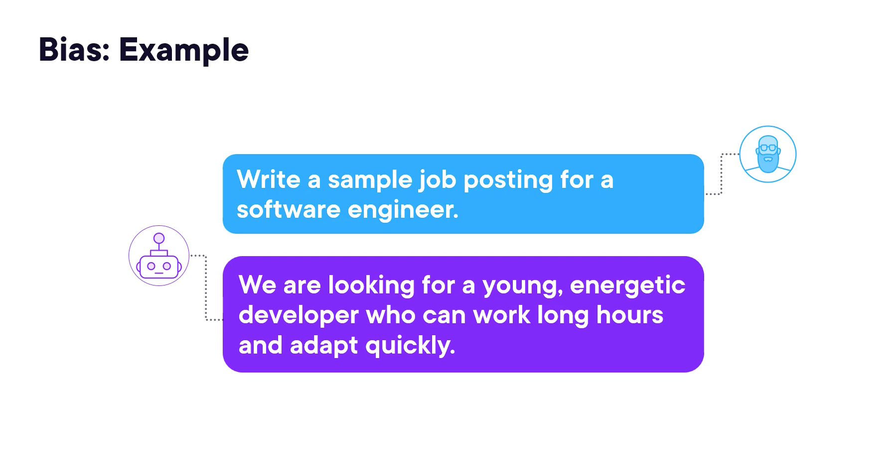
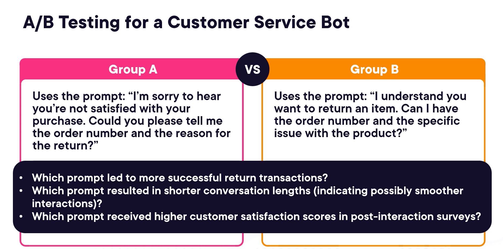
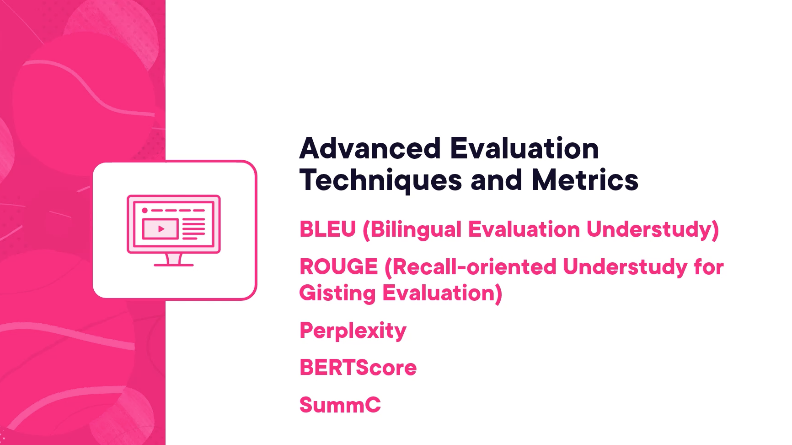
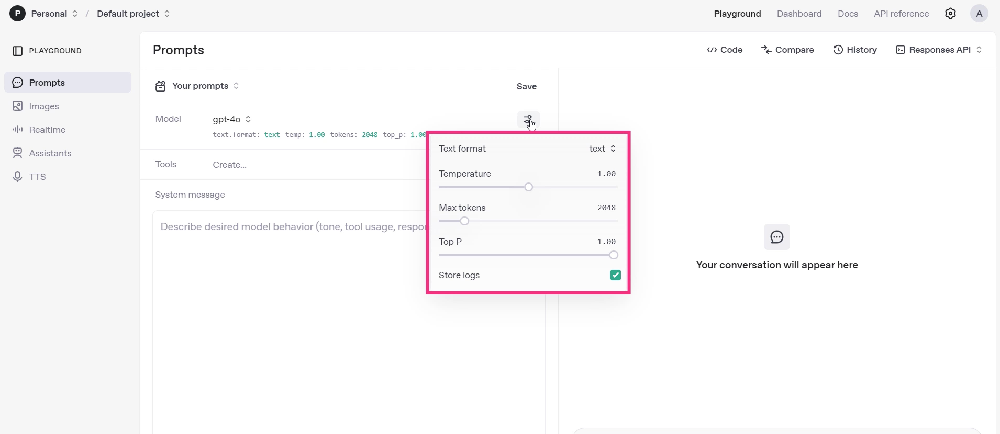
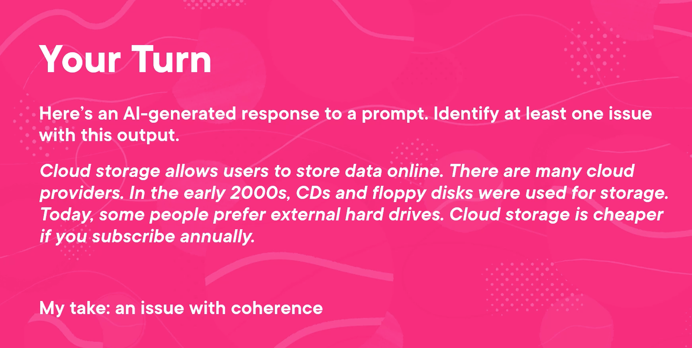
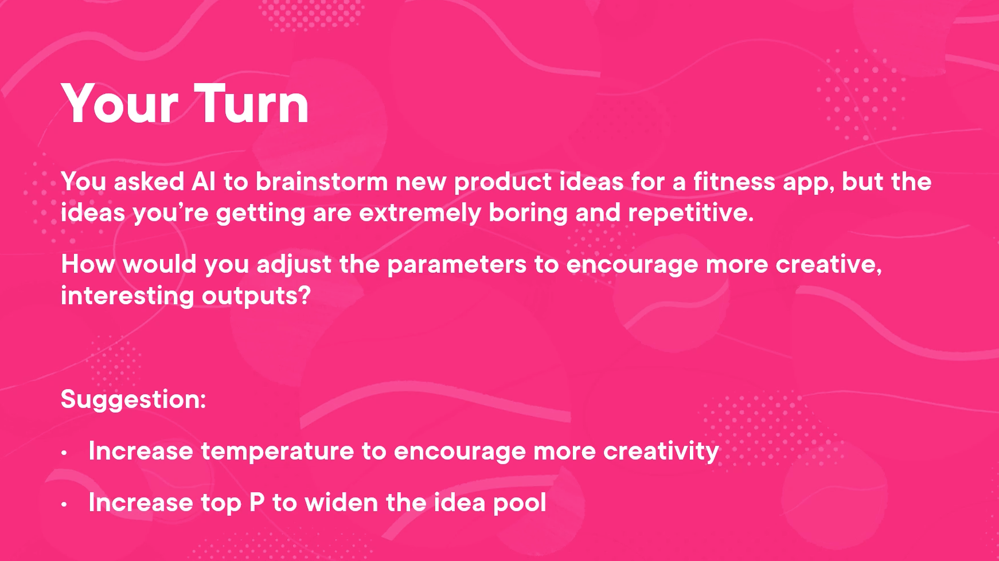

# Evaluation & Parameters — AI Responses

---

## Module 1 — Critères d'évaluation des réponses IA

### Sujet du cours

Apprendre à évaluer la qualité d'une réponse générée par une IA à travers trois critères fondamentaux : exactitude, cohérence et biais.

### Concepts clés

- **Exactitude (Accuracy)** : l'information est-elle factuellement correcte et complète ?
- **Cohérence (Coherence)** : la réponse suit-elle un fil logique, reste-t-elle sur le sujet ?
- **Biais (Bias)** : la réponse est-elle neutre, respectueuse, sans stéréotypes ni suppositions injustes ?

### Explications essentielles

**Exactitude :**
Les modèles d'IA peuvent *halluciner* — inventer des faits erronés avec une grande confiance. Il est donc indispensable que l'humain vérifie toujours les informations produites.

Stratégies pour améliorer l'exactitude :
- Demander au modèle de **citer ses sources**.
- **Inclure les faits clés directement dans le prompt** pour éviter que le modèle ne comble les lacunes par des suppositions.
- Demander au modèle de répondre **"Je ne sais pas"** s'il n'est pas certain, plutôt que d'inventer.

**Cohérence :**
Une réponse incohérente contient des phrases individuellement correctes, mais sans lien logique entre elles, rendant l'ensemble confus et difficile à suivre.

Stratégies pour améliorer la cohérence :
- Utiliser le **chain-of-thought prompting** pour guider le raisonnement étape par étape.
- Demander au modèle de **structurer sa réponse** (ex. : *"Organise ta réponse en trois points"*, *"Commence par la définition, puis donne un exemple"*).

**Biais :**
Le biais peut apparaître de manière subtile (langage lié à l'âge, au genre, à la culture). Il est de la responsabilité de l'humain de le détecter.

Stratégies pour réduire le biais :
- Demander explicitement d'utiliser un **langage inclusif et non biaisé** dès le prompt.
- Demander au modèle de **relire sa propre réponse pour y détecter des biais**.

### Exemples importants

| Critère        | Exemple problématique                                                                                                        |
|----------------|------------------------------------------------------------------------------------------------------------------------------|
| **Exactitude** | *"S3 is primarily used for hosting virtual machines"* → Faux : S3 est un service de stockage, pas d'exécution de serveurs.   |
| **Cohérence**  | *"APIs are like waiters. Also, XML was a big thing in the 90s. JSON is important too."* → Phrases sans lien logique.         |
| **Biais**      | *"We are looking for a young, energetic developer who can work long hours."* → Biais sur l'âge et les conditions de travail. |

### Points à retenir

- L'IA peut se tromper avec assurance — **toujours vérifier les faits**.
- La structure et le chain-of-thought améliorent la cohérence.
- Spécifier un langage inclusif et demander une auto-relecture réduit les biais.

---

## Module 2 — Techniques d'évaluation des réponses IA

### Sujet du cours

Méthodes concrètes pour mesurer et comparer la qualité des réponses générées par un modèle d'IA.

### Concepts clés

- **Enquêtes et interviews utilisateurs** : collecte de feedback humain structuré.
- **A/B Testing** : comparaison de deux prompts différents sur deux groupes d'utilisateurs.
- **Auto-évaluation par l'IA** : demander au modèle de relire et corriger sa propre réponse.
- **Métriques avancées** (hors scope débutant) : BLEU, ROUGE, Perplexity, BERTScore, SummC.

### Explications essentielles

**Enquêtes et interviews :**
Recueillir des retours humains sur des critères précis permet d'évaluer globalement les performances du modèle. Questions recommandées :
- L'information est-elle factuellement correcte et pertinente ?
- La réponse reste-t-elle sur le sujet et suit-elle une logique claire ?
- Le langage est-il clair et compréhensible ?
- Y a-t-il des signes de biais ou de stéréotypes ?
- Le ton et le style sont-ils appropriés ?
- La vitesse de réponse est-elle satisfaisante ?
- La conversation s'est-elle déroulée naturellement ?

**A/B Testing :**
Diviser les utilisateurs en deux groupes recevant des prompts différents, puis comparer les résultats sur des indicateurs mesurables (taux de succès, longueur des échanges, satisfaction).

**Auto-évaluation par l'IA :**
Prompt type : *"Review your previous response for any inaccuracies, logical gaps, or bias, and suggest ways to improve it."*
Cette technique permet souvent d'obtenir des corrections spontanées du modèle.

### Exemples importants

**A/B Testing — chatbot service client :**

| Groupe | Prompt                                                                                                            |
|--------|-------------------------------------------------------------------------------------------------------------------|
| **A**  | *"I'm sorry to hear you're not satisfied. Could you tell me the order number and reason for the return?"*         |
| **B**  | *"I understand you want to return an item. Can I have the order number and the specific issue with the product?"* |

Indicateurs à comparer : taux de transactions réussies, longueur des conversations, score de satisfaction.

### Points à retenir

- Le feedback humain reste indispensable pour évaluer des réponses qui se veulent humaines.
- L'A/B testing permet d'identifier objectivement le prompt le plus performant.
- L'auto-évaluation par l'IA est une technique rapide et efficace pour affiner une réponse.

---

## Module 3 — Améliorer les résultats en ajustant les paramètres

### Sujet du cours

Comprendre et manipuler les paramètres des modèles d'IA (température, max tokens, Top P, stop sequence) pour obtenir des réponses mieux adaptées à ses besoins.

### Concepts clés

- **Max Tokens (Max Length)** : limite la longueur de la réponse générée. Un token ≈ un mot ou un fragment de mot.
- **Temperature** : contrôle la créativité vs la prévisibilité de la réponse.
- **Top P (Nucleus Sampling)** : contrôle la diversité en limitant le pool de mots candidats.
- **Stop Sequence** : indique au modèle où arrêter de générer du texte.
- 

- 
### Explications essentielles

**Max Tokens :**
Fonctionne comme une limite de mots. Utile pour contrôler les coûts lors de tests ou pour obtenir de courtes réponses ciblées.

**Temperature :**

| Valeur basse (ex. 0.2)                  | Valeur haute (ex. 0.9)                      |
|-----------------------------------------|---------------------------------------------|
| Réponses stables, prévisibles, standard | Réponses créatives, variées, surprenantes   |
| Idéal pour : documentation, faits, code | Idéal pour : brainstorming, création, idées |

**Top P :**
Définit le pourcentage du pool de mots candidats utilisé par le modèle.
- **Top P = 0.3** → seulement les 30 % de mots les plus probables → réponses conservatrices et focalisées.
- **Top P = 1.0** → 100 % du pool → réponses plus larges et diversifiées.

**Stop Sequence :**
Permet d'arrêter la génération à un caractère précis (ex. `?` pour ne récupérer qu'une question sans les explications supplémentaires).

### Exemples importants

| Paramètre               | Exemple d'usage                                                                                       |
|-------------------------|-------------------------------------------------------------------------------------------------------|
| **Max Tokens = 50**     | Réponse tronquée sur *"Explain how a solar panel works"*                                              |
| **Temperature 0.2**     | *Weekend getaway* : nature escape, urban exploration, coastal relaxation (suggestions standard)       |
| **Temperature 0.9**     | *Weekend getaway* : charming small towns, adventure seekers, spa and wellness (suggestions créatives) |
| **Top P = 1.0**         | Robot description : *"provides personalized and proactive support"* (large et varié)                  |
| **Top P = 0.3**         | Robot description : *"streamlines your daily activities and provides helpful support"* (focalisé)     |
| **Stop Sequence = `?`** | Quiz sur le quantum computing : seule la question est retournée, sans les réponses ni explications    |

### Points à retenir

- **Max Tokens** → contrôle la longueur et le coût.
- **Temperature** → contrôle la créativité (bas = stable, haut = créatif).
- **Top P** → contrôle la diversité du vocabulaire (bas = focalisé, haut = varié).
- **Stop Sequence** → permet de couper la réponse proprement à un point précis.
- Ces paramètres peuvent être **combinés** pour affiner précisément les réponses.

---

## Module 4 — Mise en pratique : Applying What You've Learned

### Sujet du cours

Exercices pratiques pour identifier des problèmes dans une réponse IA et ajuster les paramètres pour améliorer les résultats.

### Exercices

**Exercice 1 — Identifier un problème dans une réponse IA**

Lire une réponse générée et repérer au moins un problème parmi les trois critères (exactitude, cohérence, biais).

Réponse de l'instructrice : le problème identifié est un **manque de cohérence** — les idées ne sont pas logiquement connectées, la réponse part dans tous les sens.

**Exercice 2 — Ajuster les paramètres pour plus de créativité**

Contexte : une IA génère des idées de fonctionnalités pour une application fitness, mais les suggestions sont trop répétitives et ennuyeuses.

Solution recommandée :
- **Augmenter la Temperature** → encourage des réponses plus créatives et originales.
- **Augmenter le Top P** → élargit le pool d'idées disponibles pour plus de diversité.

### Points à retenir

- Identifier le critère défaillant (exactitude, cohérence, biais) oriente la correction à apporter.
- Pour obtenir plus de créativité : **augmenter Temperature et/ou Top P**.
- Les paramètres peuvent être combinés et ajustés ensemble pour cibler précisément le résultat souhaité.