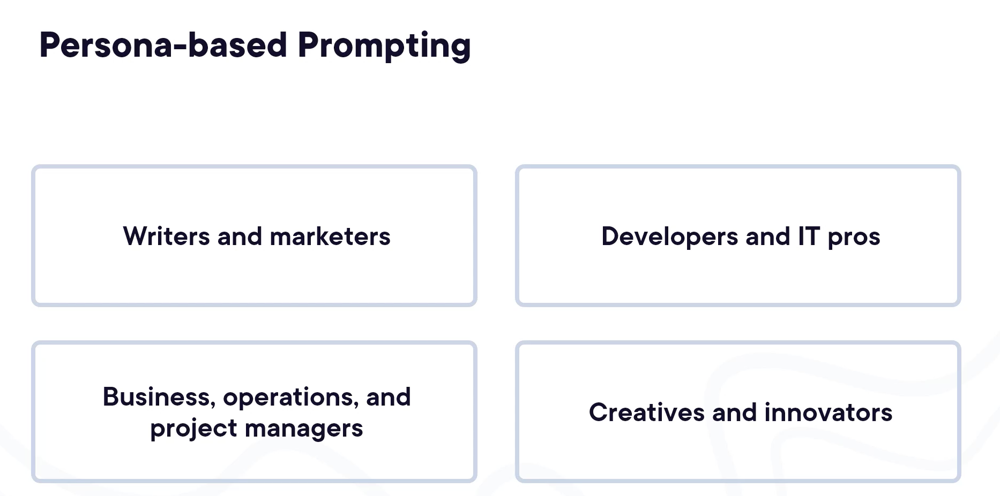
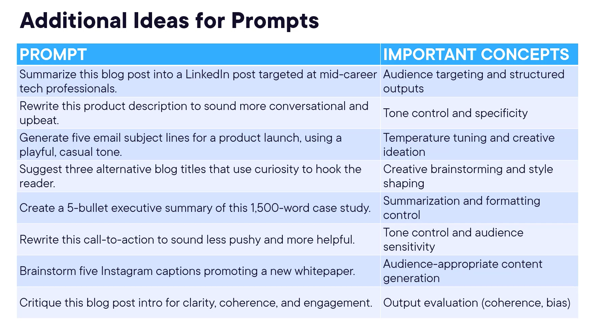
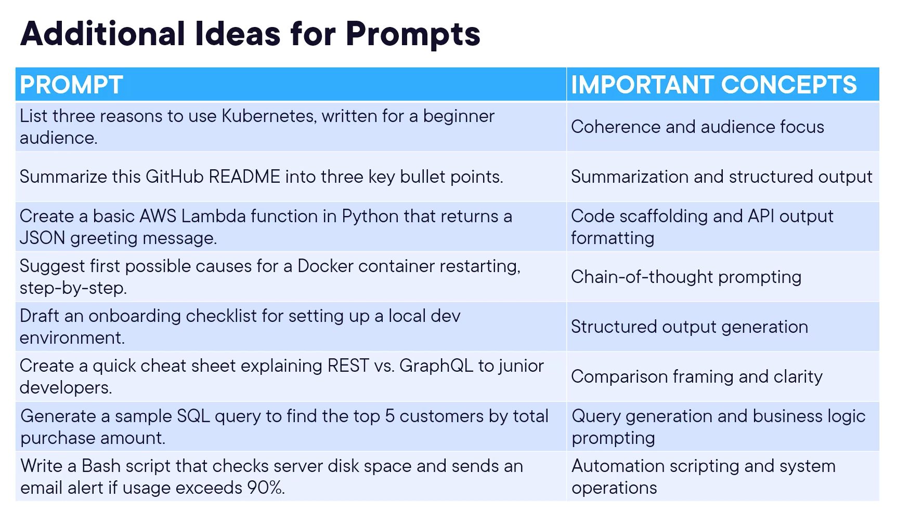
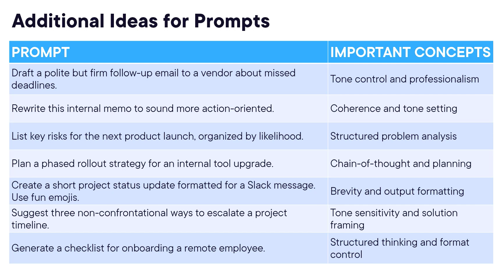
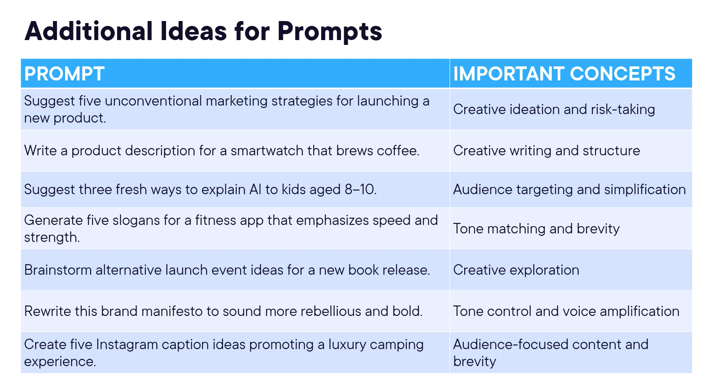

# Role-based Prompt Engineering in the Real World

---

## Module 1 — Introduction : le prompt engineering dans la vraie vie

### Sujet du cours

Appliquer le prompt engineering à des cas d'usage concrets selon différents profils professionnels : writers/marketers, développeurs, business/ops/PM, créatifs.

### Concepts clés

- **Approche persona** : les stratégies de prompting varient selon le rôle, mais les techniques restent transversales et réutilisables d'un profil à l'autre.
- **Itération** : aucun prompt n'est parfait du premier coup — affiner progressivement est la norme.

### Points à retenir

- Les techniques vues dans les sections suivantes sont **applicables à tous les rôles**, pas seulement au profil décrit.
- La question clé à se poser : *"Quelle est la tâche que je pourrais déléguer à l'IA dès aujourd'hui ?"*

---

## Module 2 — Prompting pour les Writers et Marketers

### Sujet du cours

Utiliser l'IA pour générer et affiner du contenu marketing (titres, posts, emails, résumés) rapidement et efficacement.

### Méthodes / Raisonnements

- **Demander plus que nécessaire** : demander 10 idées quand on en veut 3 permet de choisir les meilleures sans manquer d'options.
- **Itérer sur le style, le ton et le focus** : chaque ajustement du prompt (plus joueur, axé sur les émotions, sous forme de questions) produit un résultat sensiblement différent.

### Exemples importants

**Prompt de départ :**
> *Generate 10 catchy headlines for a LinkedIn post about the benefits of remote work. Audience: mid-career professionals.*

**Itérations successives :**

| Itération | Ajustement                                                            |
|-----------|-----------------------------------------------------------------------|
| 1         | *Update these headlines to be more playful but still professional.*   |
| 2         | *Focus on emotional benefits like flexibility and work-life balance.* |
| 3         | *Format some as questions to grab attention.*                         |

Chaque ajustement produit une liste différente, plus ciblée et adaptée au besoin.

### Points à retenir

- Un petit changement de **style, focus ou format** dans le prompt change significativement le résultat.
- Idéal pour : posts réseaux sociaux, emails, résumés exécutifs, articles de blog.

---

## Module 3 — Prompting pour les Développeurs et IT Pros

### Sujet du cours

Utiliser l'IA pour générer, améliorer et optimiser du code, en itérant à partir d'une base fonctionnelle vers un résultat professionnel.

### Méthodes / Raisonnements

- **Partir d'un premier jet fonctionnel** : le premier output donne une base de travail rapide, pas un code de production.
- **Itérer par couches** : ajouter la gestion d'erreurs, le tri, le formatage, l'optimisation en étapes séparées.

### Exemples importants

**Prompt de départ :**
> *Write a Python script that reads a CSV file and outputs a formatted summary report.*

**Itérations successives :**

| Itération | Ajustement                                                            |
|-----------|-----------------------------------------------------------------------|
| 1         | *Handle errors for missing or invalid data in the CSV file.*          |
| 2         | *Sort the output by highest total sales.*                             |
| 3         | *Format the report nicely as a table in the console output.*          |
| 4         | *Optimize this for larger CSV files using efficient data structures.* |

### Points à retenir

- Le premier output est un **point de départ**, pas un résultat final.
- Atteindre un code professionnel et robuste **nécessite toujours plusieurs itérations**.
- Autres usages courants : débogage, documentation, revue de code, explication de concepts techniques.

---

## Module 4 — Prompting pour les Business, Operations et Project Managers

### Sujet du cours

Utiliser l'IA pour synthétiser, restructurer et adapter des informations complexes à des audiences exécutives, en gérant le ton et les priorités.

### Méthodes / Raisonnements

- **Cadrer le format et le ton dès le départ** : préciser le nombre de points, le registre (factuel, sans jargon émotionnel) et l'audience cible.
- **Restructurer selon les priorités** : trier par urgence, isoler les risques et deadlines pour un impact maximal auprès des décideurs.

### Exemples importants

**Prompt de départ :**
> *Summarize this vendor update in 5 executive-friendly bullet points, focusing on facts and next steps only. Avoid emotional language.*

**Itérations successives :**

| Itération | Ajustement                                                    |
|-----------|---------------------------------------------------------------|
| 1         | *Make it more concise — under 15 words per bullet.*           |
| 2         | *Organize bullets by urgency, most urgent first.*             |
| 3         | *Highlight any major risks or upcoming deadlines separately.* |

### Points à retenir

- La summarization ne consiste pas seulement à **condenser**, mais aussi à **remodeler** l'information selon l'audience et les priorités.
- L'IA est particulièrement utile pour **doser le ton** dans des communications sensibles (emails délicats, messages à enjeux).

---

## Module 5 — Prompting pour les Créatifs et Innovateurs

### Sujet du cours

Utiliser l'IA comme partenaire de brainstorming pour générer des idées créatives (noms de marques, concepts, campagnes) en guidant l'IA par itérations successives.

### Méthodes / Raisonnements

- **Ne pas se contenter du premier jet** : la créativité avec l'IA est un processus collaboratif et progressif.
- **Affiner par contraintes successives** : chaque contrainte ajoutée (un seul mot, thème nature/mythologie, noms émotionnellement forts) oriente l'IA vers une direction plus précise.

### Exemples importants

**Prompt de départ :**
> *Generate 10 adventurous, inspiring brand names for a travel company focused on exploration and personal growth.*

**Itérations successives :**

| Itération | Ajustement                                                           |
|-----------|----------------------------------------------------------------------|
| 1         | *Make them bolder and more emotionally charged.*                     |
| 2         | *Suggest one-word names only.*                                       |
| 3         | *Inspire from nature or mythology, with explanations for each name.* |

### Points à retenir

- L'IA est un **outil de brainstorming puissant**, mais c'est l'humain qui guide et choisit.
- Plus la contrainte est précise (format, thème, registre), plus les suggestions sont pertinentes.

---

## Module 6 — Mise en pratique : Applying What You've Learned

### Sujet du cours

Exercice de synthèse finale : construire un prompt structuré sur une tâche réelle et l'affiner par itération.

### Exercice

1. **Choisir une tâche réelle** : rédaction, résumé, brainstorming, planification, explication, etc.
2. **Créer un prompt structuré** en appliquant les composants vus dans le cours (persona, instructions, contexte, format, contraintes).
3. **Bonus** : soumettre le prompt à un outil IA et l'améliorer avec au moins **une itération**.

### Points à retenir

- Un bon prompt engineering est une **compétence transversale**, applicable à tous les rôles et contextes.
- La maîtrise vient avec la **pratique et l'itération** — chaque échange avec l'IA est une opportunité d'affiner sa technique.
- Les outils IA s'améliorent continuellement : une solide base en prompt engineering reste un **avantage durable**.